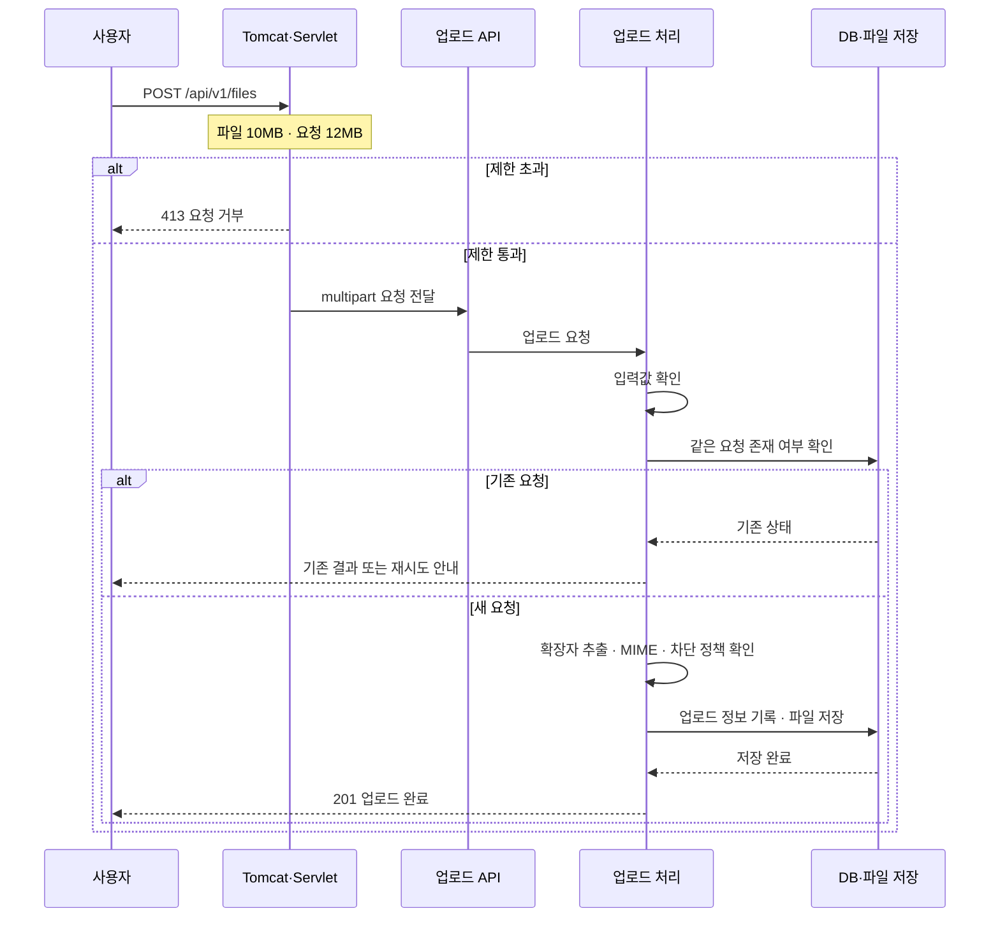
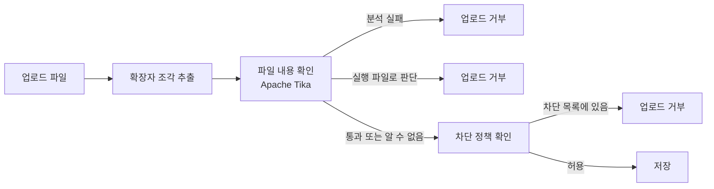
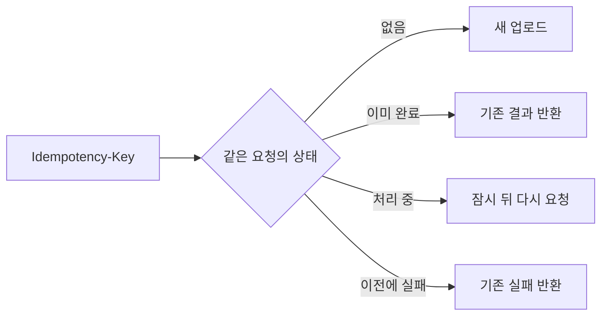
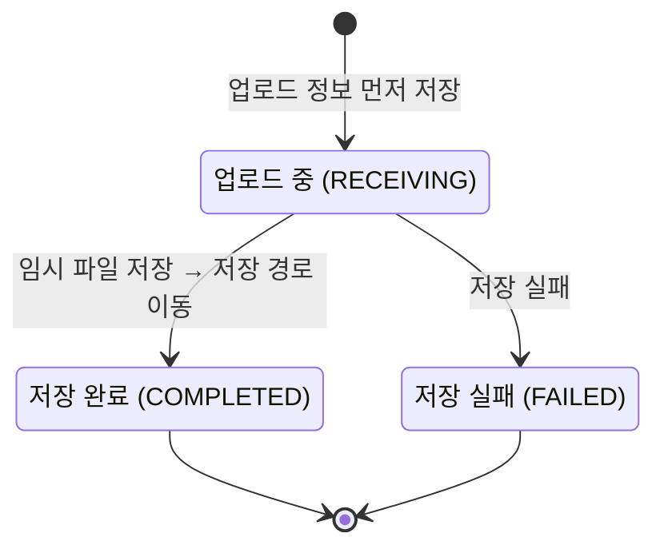
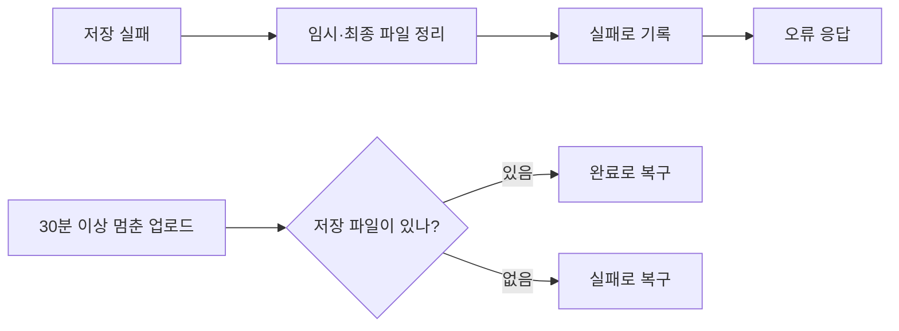
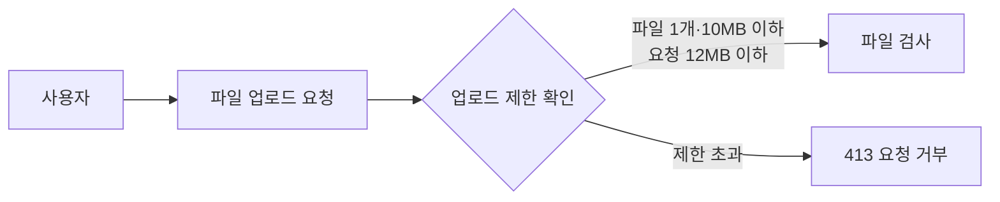
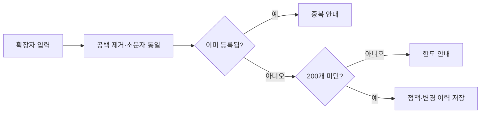
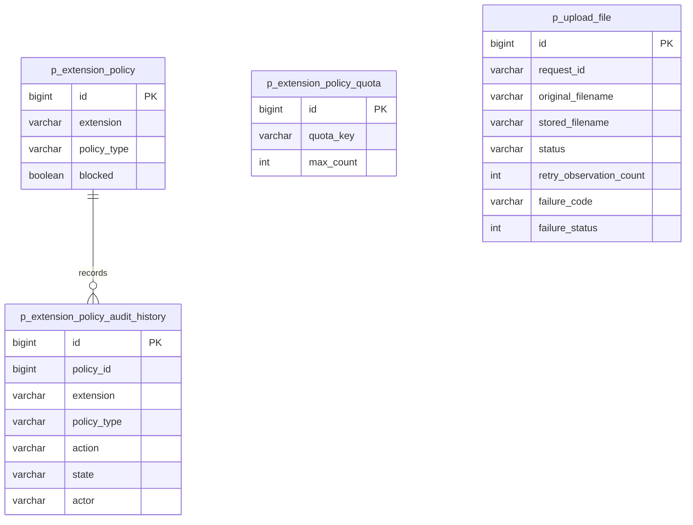

# 파일 업로드 확장자 정책

고정·커스텀 확장자 차단 정책을 관리하고 안정적인 파일 업로드 기능을 구현한 Spring Boot 프로젝트입니다.

| 바로가기 | 내용 |
|---|---|
| 배포 URL | [file-upload-production-4b7b.up.railway.app](https://file-upload-production-4b7b.up.railway.app) |
| [API 명세](docs/file-upload-api.md) | 정책 관리·파일 업로드 요청·응답·오류 계약 |
| [파일 업로드 고려사항 (CONSIDERATIONS.md)](CONSIDERATIONS.md) | 보안·데이터·UX·운영 관점의 핵심 판단 10개 |
| [AI 프롬프트](docs/ai-prompt.md) | AI 제안을 검증하고 보완·선택한 대표 사례 |
| [AI 협업 방식](docs/ai-assisted-development-workflow.md) | 요구사항 분해, ADR, TDD, 검증으로 이어진 개발 흐름 |

## 기능 구현 현황

상세한 판단과 근거는 [파일 업로드 고려사항](CONSIDERATIONS.md)에 정리했습니다.

### 구현 및 고려사항

#### A. 확장자 차단 정책 관리

- 고정 확장자 `bat`, `cmd`, `com`, `cpl`, `exe`, `scr`, `js`를 차단 해제 상태로 초기화하고 DB에 상태 저장
- check/uncheck 결과를 저장하고 새로고침 시 서버 상태로 복원
- 커스텀 확장자를 최대 20자·200개까지 등록·삭제하고, 고정 확장자와 중복 등록 방지
- trim·소문자 정규화, 서비스 검사, DB `UNIQUE` 제약과 quota 행 비관적 잠금으로 중복·동시 초과 등록 방지

#### B. 실제 파일 업로드 처리

- 화면 우회 요청에도 서버가 DB 차단 정책을 재판정
- 차단된 확장자를 `BLOCKED_EXTENSION`과 함께 반환하고 화면에서 한국어로 안내
- 정상 파일은 서버가 생성한 UUID 파일명으로 로컬에 저장하고 `201 Created` 응답

#### C. 검증·보안

- Apache Tika로 파일 바이트 기반 MIME을 감지하고 실행 MIME을 저장 전 차단
- 대소문자를 정규화하고 `file.exe.txt`, `archive.tar.gz`의 모든 확장자 구간을 exact match로 검사
- 확장자 없는 파일과 dotfile을 거부하고 원본 basename을 255 Unicode code point로 제한
- 내장 Tomcat·Servlet multipart 경계에서 파일 10MB, 요청 12MB로 제한
- 업로드 API는 파일 하나만 허용하고, 두 개 이상은 `400 MULTIPLE_FILES_NOT_ALLOWED`로 저장 전에 거부
- 경로를 제거한 basename만 메타데이터로 보존하고 실제 경로는 UUID 저장명으로 생성

#### D. 정책·데이터

- 단일 정책 테이블과 도메인 규칙으로 고정·커스텀 확장자의 중복을 방지
- 초기화·생성·상태 변경·삭제를 append-only 이력으로 저장하고 현재 정책과 같은 트랜잭션으로 처리
- 21자·201번째 요청의 한국어 안내·입력값 보존·목록 유지를 브라우저에서 검증
- 200개 전체 조회·렌더링을 검증하고, 운영 상한이 작아 검색·페이징은 적용하지 않음

#### E. UX·예외

- 오류 `code`와 검증된 `context`로 차단 사유를 화면에서 조립
- 처리 중 컨트롤 비활성화, 상태 메시지, 정책 재조회, 업로드 재시도 상한 구현
- 정책 변경 실패 시 서버 상태로 화면을 복구하고, 파일 저장 실패 시 부분 파일 정리와 `FAILED` 상태 기록

#### F. 운영

- 새로고침과 실패 후 DB 최신 상태를 재조회하고, `UNIQUE`·quota·비관적 잠금으로 동시 요청의 불변식 보호
- `requestId`, 오류 code·HTTP status를 로그에 남기고 정책 변경은 감사 이력으로 보존

#### G. 추가 고려사항

- `UNKNOWN` MIME은 확장자 정책으로 계속 판정하고, MIME 분석 실패 `FAILED`는 저장 전 거부
- `RECEIVING` 선저장, 임시 파일, atomic move, `COMPLETED`·`FAILED`, stale 복구로 DB–파일시스템 실패 구간 관리
- UUID v4 `Idempotency-Key`로 완료 결과를 재사용하고 처리 중에는 `409 + Retry-After`를 반환해 중복 저장 방지

## 핵심 업로드 흐름



세부 상태 코드와 오류 응답 계약은 [API 명세](docs/file-upload-api.md)에서 확인할 수 있습니다.

## 핵심 판단

### 1. 확장자·MIME 차단 흐름



`report.exe.pdf`는 `exe`, `pdf`를 모두 검사합니다. 파일 형식을 알 수 없어도 확장자 정책은 계속 확인하고, 파일 내용을 읽지 못하면 저장 전에 거부합니다.

### 2. 동일 요청 멱등 키 정책



UUID v4 키를 `requestId`로 저장합니다. 동시에 같은 요청이 와도 DB 중복 규칙과 잠금으로 하나의 업로드만 처리합니다.

### 3. 업로드 저장 상태 전이



서버가 UUID 저장명을 만들고 업로드 정보를 먼저 기록합니다. 저장 경로로 파일 이동이 끝난 뒤에만 완료로 바꿉니다.

### 4. 저장 실패·중단 복구



1분마다 30분 이상 멈춘 업로드를 점검합니다. 파일 정리 실패는 원래 저장 오류를 대신해 외부로 노출하지 않습니다.

### 5. 업로드 요청 크기·개수 제한



파일을 받는 단계에서 개수와 크기를 먼저 제한합니다. 통과한 요청만 확장자·파일 내용 검사로 전달합니다.

### 6. 커스텀 확장자 등록 정합성



동시에 등록 요청이 와도 등록 가능 개수를 잠그고 DB 중복 규칙을 함께 적용해, 중복과 200개 초과를 막습니다.

판단의 대안, trade-off, 남은 한계는 [CONSIDERATIONS.md](CONSIDERATIONS.md)에 정리했습니다.

## API

| Method | Endpoint | 역할 | 성공 응답 |
|---|---|---|---|
| `GET` | `/api/v1/extension-policies` | fixed·custom 정책 조회 | `200` |
| `PATCH` | `/api/v1/extension-policies/fixed/{extension}` | 고정 확장자 차단 상태 변경 | `200` |
| `POST` | `/api/v1/extension-policies/custom` | 커스텀 확장자 등록 | `201` |
| `DELETE` | `/api/v1/extension-policies/custom/{extension}` | 커스텀 확장자 삭제 | `204` |
| `POST` | `/api/v1/files` | 파일 업로드와 정책 강제 | `201` |

요청·응답 예시와 전체 오류 코드는 [API 명세](docs/file-upload-api.md)를 기준으로 합니다.

## ERD



감사 이력은 정책 변경 당시의 확장자·유형·상태를 함께 저장합니다. 정책이 삭제된 뒤에도 변경 기록은 남고, `policy_id`는 같은 정책의 이력을 추적하는 데 사용합니다.

## 기술 스택과 실행

Java 21 · Spring Boot 3.5 · Spring Data JPA · H2 · Thymeleaf/Axios · Apache Tika · JUnit 5

```bash
./gradlew bootRun
```

실행 후 `http://localhost:8080/`에서 정책 관리와 파일 업로드를 확인합니다. 업로드 파일은 기본값 `./uploads`, H2 파일 DB는 `./data` 아래에 생성됩니다.

```bash
./gradlew test
```
