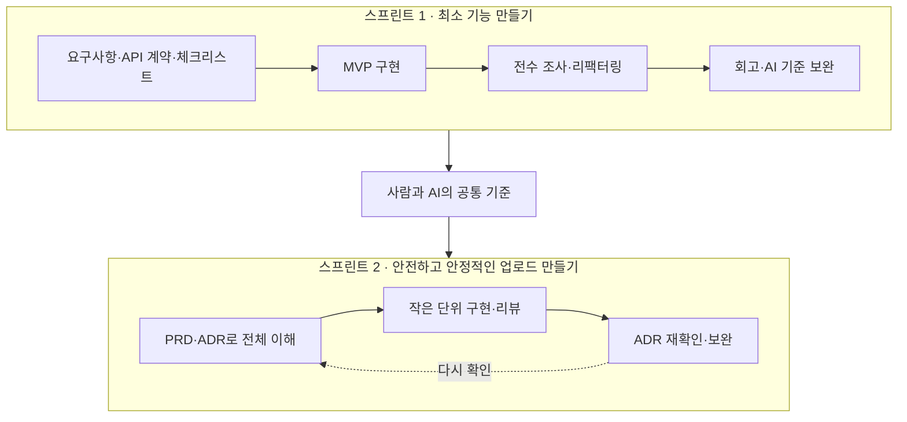
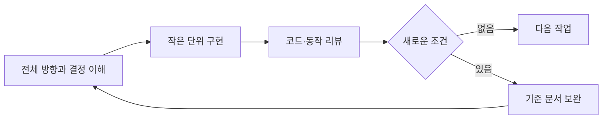

# 프로젝트 AI 워크플로우

## 전체 방향

두 스프린트는 기능의 크기가 아니라 학습 순서에 따라 나누었습니다. 먼저 최소 기능을 실제 코드로 만들면서 개발자의 기준을 AI에 반영하고, 그 기준을 바탕으로 다음 스프린트에서 안전성과 안정성을 확장했습니다.

## 스프린트 1: 최소 기능을 먼저 만들었습니다

처음부터 모든 예외와 구조를 설계하기보다, 파일 업로드 확장자 정책의 최소 기능을 빠르게 구현했습니다. 구체적인 결과물이 있어야 AI가 제가 원하는 책임 분리와 표현 방식을 이해할 수 있고, 저 역시 AI가 만든 코드를 기준으로 수정 방향을 판단할 수 있기 때문입니다.

요구사항을 해석해 검증 기준과 API 계약을 정리한 뒤, 체크리스트로 구현 범위를 고정했습니다. 체크리스트의 목적은 작업 목록을 늘리는 것이 아니라, AI가 정해진 범위와 순서를 유지하도록 작업을 보이게 만드는 데 있었습니다.

MVP가 동작한 뒤에는 결과물을 그대로 끝내지 않았습니다. 전수 조사로 제가 예상한 코드와 다른 부분을 찾고, 이해되지 않는 부분을 질문한 뒤 리팩터링했습니다. 마지막 회고에서는 이때 확인한 코드 구조와 협업 방식을 다음 작업의 AI 기준으로 남겼습니다.

스프린트 1의 핵심은 MVP 자체보다 **MVP를 통해 사람과 AI의 기준을 맞춘 것**입니다.

## 스프린트 2: ADR로 전체를 이해한 뒤 확장했습니다

스프린트 2에서는 파일 업로드를 안전하고 안정적으로 만들기 위해 보안, 저장 상태, 실패 처리를 확장했습니다. 이 문제들은 서로 영향을 주므로 기능을 하나씩 바로 구현하면 전체 흐름과 맞지 않는 선택을 할 수 있었습니다.

먼저 PRD로 스프린트의 전체 목표를 잡고, 사람이 결정해야 하는 내용을 ADR로 분리했습니다. ADR을 작성할 때는 문서를 개별적으로 확정하지 않고 서로 연결해 보면서, 하나의 선택이 다른 정책과 상태·오류 처리에 미치는 영향을 먼저 확인했습니다.

그다음 각 ADR을 작은 구현 단위로 옮겨 AI에게 작업을 맡기고, 구현 결과가 전체 방향과 맞는지 바로 리뷰했습니다. 구현 중 새로운 조건이 발견되면 ADR과 체크리스트를 다시 확인하고 보완했습니다. 따라서 ADR은 코딩 전에만 읽는 문서가 아니라, 구현을 진행하면서 다시 판단하는 기준이었습니다.

스프린트 2의 핵심은 **전체를 이해한 뒤 작게 구현하고, 구현 결과로 전체 결정을 다시 확인한 것**입니다.

## 핵심 피드백 루프

이 워크플로우에서 AI는 전체 결정을 대신하지 않습니다. 사람은 방향과 중요한 선택을 정하고, AI는 작은 단위의 구현을 수행합니다. 구현과 리뷰에서 얻은 피드백은 다시 기준 문서와 다음 작업에 반영합니다.
