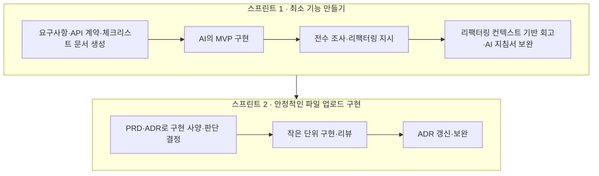
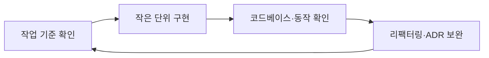

# 프로젝트 AI 워크플로우

## 전체 방향

## 스프린트 1: 최소 기능 만들기

- 목표: 파일 업로드 확장자 정책의 최소 기능을 완성합니다.
- 시작 이유:
  - 빠르게 API를 구현하기 위해 사람의 개입은 최소 기능의 기준을 정하는 데 집중합니다.
  - 구현은 AI가 수행하고, 구현 결과를 기반으로 직접 코드베이스를 확인합니다.
  - 확인한 내용을 바탕으로 리팩터링을 지시하고, 해당 리팩터링 컨텍스트를 이용해 AI 지침서를 보강합니다.
  - 보강한 AI 지침서로 이후 AI 코딩 결과물을 조정합니다.
- 핵심 흐름:
  1. 요구사항과 API 계약을 문서로 정리하고 작업 체크리스트를 생성합니다.
  2. 체크리스트를 기준으로 AI가 MVP를 구현합니다.
  3. 구현 결과를 전수 조사하고, 필요한 리팩터링을 지시합니다.
  4. 리팩터링 컨텍스트를 기반으로 회고합니다.
  5. 회고 결과를 AI 지침서에 보완합니다.

## 스프린트 2: 안정적인 파일 업로드 구현

- 개요: 최소 기능으로 구현한 파일 업로드를 안전하고 안정적으로 확장합니다.
- 목표: 추가로 구현해야 하는 범위를 정의하고, 각 범위에 대한 정책과 구현 방향을 결정합니다.
- 핵심 흐름:
  1. 파일 업로드에서 추가로 고려해야 하는 상황을 목록화합니다.
  2. 각 상황에 대한 판단을 내리고 ADR을 작성합니다.
  3. ADR을 바탕으로 PRD를 생성해 확장 스프린트의 전체 내용을 이해합니다.
  4. ADR별로 작업을 나누어 작은 단위의 실제 구현을 진행합니다.
  5. 구현 과정에서 직접 코드베이스를 확인하고 코드 리뷰를 진행합니다.
  6. 구현 결과를 기준으로 ADR의 판단을 한 번 더 점검하고 필요한 부분을 조정·보완합니다.

## 핵심 피드백 루프

- 사람의 역할: 작업 범위와 중요한 판단을 정하고, 구현 결과를 직접 확인합니다.
- AI의 역할: 합의된 기준에 따라 문서를 만들고 작은 단위의 구현을 수행합니다.
- 피드백의 역할: 코드베이스에서 확인한 내용을 리팩터링, ADR과 AI 지침서에 반영합니다.
